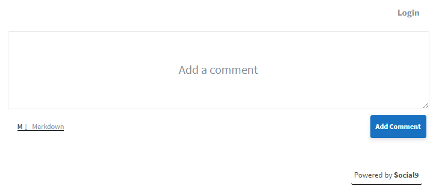

# gatsby-plugin-social9-comment

Welcome to the Social9 Comments! If you're here for the first time, read this page to get started; it'll answer most of the frequently asked questions.

## Install

`npm install --save gatsby-plugin-social9-comment`

## How to use

```javascript
// In your gatsby-config.js
module.exports = {
	plugins: [{
		resolve:  `gatsby-plugin-social9-comment`,
	}],
}
```

## Usage

You can use the plugin as shown in this brief example:

```javascript
import { S9comment } from 'gatsby-plugin-social9-comment'

const PostTemplate = () => {
  return (
    <>
      <h1>{post.title}</h1>
      /* Post Contents */
      <S9comment />
    </>
 )
}
export default PostTemplate
```

## local package

```javascript
// In your gatsby-config.js
module.exports = {
	plugins: [{
		resolve:  require.resolve(`../path/to/gatsby-plugin-social9-comment`),
	}],
}
```

## Usage

You can use the plugin as shown in this brief example:

```javascript
import { S9comment } from  './path/to/gatsby-plugin-social9-comment'

const PostTemplate = () => {
  return (
    <>
      <h1>{post.title}</h1>
      /* Post Contents */
      <S9comment />
    </>
 )
}
export default PostTemplate
```

## Description -

Welcome to the Social9 Comments! If you're here for the first time, read this page to get started; it'll answer most of the frequently asked questions.

## What is Social9 Comments?

Comments help you to grow discussions on your website – if you have a blog, you can embed Social9 Comments if you want your readers to add comments. It's fast and free, has a modern interface, and is reasonably secure. Unlike most alternatives, Commento is lightweight and privacy-focused; I'll never sell your data, show ads, embed third-party tracking scripts, or inject affiliate links.

## Frequently Asked Questions

### I don't want to install and manage Commento on a server.

Social9 comments is a cloud-based solution where we take care of the server hosting, updates, and security and performance tuning for you. It is absolutely free.

### What features does Social9 Comments have?

Commento comes with a lot of useful features out-of-the-box: rich text support, upvotes and downvotes, automatic spam detection, moderation tools, sticky comments, thread locking, OAuth login, email notifications, and more!

### What does Social9 Comments look like? Do you have a demo?

Check out the screenshot below.


### How is Comments different from Disqus, Facebook Comments, and the rest?

Most other products in this space do not respect your privacy; showing adverts is their primary business model and that nearly always comes at the users' cost. We are providing everything for free and do not compromise with privacy.

### Is Comments free software?

Yes. Comments is made freely available and it will always stay that way.

### Disqus has a free plan. Why is the cloud version not free of cost?

When I say Comments is free, I mean free. The cloud version is offered free of cost because we are more focused on delivering value. We are aiming a whole social media solution that why we are not charging anything from our customers.

### Okay, how do I get started?

Glad you asked! please follow the steps written below.